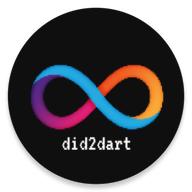

# Did2dart



Provide applications on different platforms to quickly convert Candid to Dart code.

## Download

### Web (Recommend)

The simplest way is to directly open the webpage and import the DID file for use. Of course, you can also install PWA so that you can use it offline.

[Click to open](https://did2dart.astrox.app/#/)

### Desktop

Using the client can achieve higher performance.

| Platform |                                                Download                                                |
|:--------:|:------------------------------------------------------------------------------------------------------:|
|  MacOS   |    [Click to download](https://github.com/iota9star/did2dart/releases/download/v1.0.0/did2dart.dmg)    |
|  Linux   | [Click to download](https://github.com/iota9star/did2dart/releases/download/v1.0.0/did2dart-linux.zip) |
| Windows  | [Click to download](https://github.com/iota9star/did2dart/releases/download/v1.0.0/did2dart-win32.zip) |


### Mobile

No one should generate code on a mobile device.

#### Android

| Arch      | Download                                                                                                        |
|-----------|-----------------------------------------------------------------------------------------------------------------|
| arm64-v8a | [Click to download](https://github.com/iota9star/did2dart/releases/download/v1.0.0/app-arm64-v8a-release.apk)   |
| arm64-v7a | [Click to download](https://github.com/iota9star/did2dart/releases/download/v1.0.0/app-armeabi-v7a-release.apk) |
| x86_64    | [Click to download](https://github.com/iota9star/did2dart/releases/download/v1.0.0/app-x86_64-release.apk)      |
| universal | [Click to download](https://github.com/iota9star/did2dart/releases/download/v1.0.0/app-universal-release.apk)   |

#### iOS

If you have some development experience, you can manually attempt to package the application and install it on your iOS device.

## License

```text
MIT License

Copyright (c) 2022 AstroxNetwork

Permission is hereby granted, free of charge, to any person obtaining a copy
of this software and associated documentation files (the "Software"), to deal
in the Software without restriction, including without limitation the rights
to use, copy, modify, merge, publish, distribute, sublicense, and/or sell
copies of the Software, and to permit persons to whom the Software is
furnished to do so, subject to the following conditions:

The above copyright notice and this permission notice shall be included in all
copies or substantial portions of the Software.

THE SOFTWARE IS PROVIDED "AS IS", WITHOUT WARRANTY OF ANY KIND, EXPRESS OR
IMPLIED, INCLUDING BUT NOT LIMITED TO THE WARRANTIES OF MERCHANTABILITY,
FITNESS FOR A PARTICULAR PURPOSE AND NONINFRINGEMENT. IN NO EVENT SHALL THE
AUTHORS OR COPYRIGHT HOLDERS BE LIABLE FOR ANY CLAIM, DAMAGES OR OTHER
LIABILITY, WHETHER IN AN ACTION OF CONTRACT, TORT OR OTHERWISE, ARISING FROM,
OUT OF OR IN CONNECTION WITH THE SOFTWARE OR THE USE OR OTHER DEALINGS IN THE
SOFTWARE.
```
